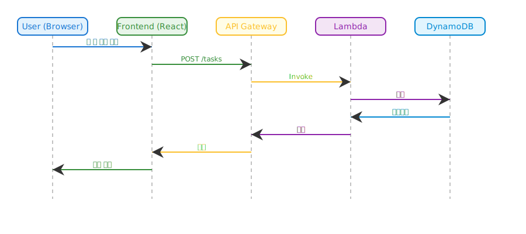

# TODO 웹 앱 설계 문서

## 1. 아키텍처 개요

본 프로젝트는 Clean Architecture 원칙을 기반으로, React + Node.js(Typescript) + AWS 서버리스(CDK, Lambda, DynamoDB) 조합으로 구성된 단일 사용자용 TODO 웹 애플리케이션입니다.

### 시스템 구성도 (SVG)

> 본 프로젝트는 모노레포 구조로 관리되며, 프론트엔드와 백엔드가 하나의 저장소 내에서 분리된 디렉터리로 관리됩니다.


<!--
- Frontend(React+Vite+TailwindCSS), Github Actions/Pages, AWS API Gateway, Lambda, DynamoDB, Cognito(구글 OAuth) 등 주요 컴포넌트와 데이터 흐름을 시각화
- REST API, 인증, 배포, 데이터 저장 등 관계 명확히 표시
-->

### 주요 시나리오 시퀀스 다이어그램 (SVG)



<!--
- 사용자가 할 일을 추가하는 전체 흐름(User → Frontend → API Gateway → Lambda → DynamoDB → Lambda → API Gateway → Frontend → User)
- 각 단계별 주요 메시지 및 응답
-->

## 2. 주요 컴포넌트 및 책임

### 2.X UX/UI 설계
- **레이아웃**: 상단 고정 헤더, 메인 영역에 할 일 목록 및 입력 폼, 하단에 필터/상태 표시
- **입력/수정**: 인라인 편집, 키보드 접근성 보장
- **상태 표시**: 할 일 완료/미완료, 전체/미완료/완료 필터
- **테마**: 다크/라이트모드 전환 버튼

#### UI/UX 와이어프레임 (SVG)


- **반응형**: 모바일/데스크탑 모두 최적화
- **피드백**: 삭제/완료 처리 시 Undo(되돌리기) 지원
- **접근성**: 명확한 포커스, ARIA 속성, 색상 대비 준수

### 2.1 프론트엔드 (React)
- **UI**: Mantine UI Kit 기반 반응형, 다크/라이트모드 지원
- 모든 UI 컴포넌트는 Mantine에서 제공하는 컴포넌트를 우선 활용하고, Theme, Color Scheme, Layout, Style props 등 Mantine의 기능을 적극 활용
- 접근성(Accessibility) 및 다크모드 지원은 Mantine의 기본 기능을 적극 활용
- **상태 관리**: React Context + useReducer
- **인증**: AWS Cognito + Google OAuth 연동
- **API 통신**: REST API (API Gateway)
- **로컬 스토리지**: 백엔드 연동 전까지는 브라우저 LocalStorage를 사용하여 할 일 데이터 관리
- **접근성**: WCAG 2.1 AA 준수
- **브라우저 호환성**: 최신 Chrome, Firefox, Safari, Edge 지원

### 2.2 백엔드 (Node.js Lambda)
- **API**: RESTful 엔드포인트 (할 일 CRUD)
- **비즈니스 로직**: Clean Architecture 기반 계층 분리
  - Presentation: Lambda 핸들러
  - Application: UseCase(비즈니스 규칙)
  - Domain: Entity/Model
  - Infrastructure: DynamoDB 연동
- **테스트**: 단위 테스트(Jest)

### 2.3 인프라 및 배포
- **API Gateway**: REST API 엔드포인트 관리
- **Lambda**: 서버리스 백엔드 실행
- **DynamoDB**: 할 일 데이터 저장
- **Cognito**: 인증/인가 (Google OAuth)
- **CI/CD**: GitHub Actions로 자동 빌드 및 테스트, 프론트엔드는 GitHub Pages로 배포
- **S3/CloudFront**: (선택) 정적 웹 배포

## 3. 폴더 구조 예시 (Monorepo)

```
root/
├── docs/
├── frontend/
│   ├── src/
│   ├── public/
│   └── ...
├── backend/
│   ├── src/
│   └── ...
├── infra/
└── ...
```

- 프론트엔드와 백엔드는 단일 저장소 내에서 `/frontend`, `/backend`로 분리 관리
- 공통 문서 및 인프라 코드는 docs, infra 등에 위치

```
root/
├── docs/
├── frontend/
│   ├── src/
│   │   ├── components/
│   │   ├── contexts/
│   │   ├── reducers/
│   │   ├── pages/
│   │   ├── api/
│   │   └── App.tsx
│   ├── public/
│   ├── tests/
│   └── ...
├── backend/
│   ├── src/
│   │   ├── application/
│   │   ├── domain/
│   │   ├── infrastructure/
│   │   └── presentation/
│   └── tests/
├── infra/
│   └── cdk/
└── .github/
    └── workflows/
```

## 4. 주요 흐름 및 마일스톤

1. **1단계: 프론트엔드 단독 TODO CRUD 구현**
   - React + Mantine UI Kit으로 UI/UX, 상태관리 구현
   - 브라우저 LocalStorage 기반 CRUD
   - GitHub Actions + Pages로 자동 배포
2. **2단계: 백엔드 연동**
   - AWS Cognito 인증(구글 OAuth)
   - API Gateway + Lambda + DynamoDB 연동
   - 프론트엔드에서 REST API 통신
   - 데이터 저장소를 LocalStorage에서 DynamoDB로 전환
3. **3단계: UI/UX 개선 및 접근성 강화**
   - 반응형, 다크/라이트모드, 접근성 테스트
4. 모든 인프라는 AWS CDK로 IaC(Infrastructure as Code)로 관리

## 5. 테스트 및 품질
- 프론트엔드: Jest, React Testing Library 기반 단위/통합 테스트
- 백엔드: Jest 기반 단위 테스트, 테스트 우선 개발(TDD)
- CI/CD: GitHub Actions 기반 자동화(빌드, 테스트, 배포)
- 브라우저 호환성: 최신 Chrome, Firefox, Safari, Edge 지원

---

> 본 설계 문서는 최신 요구사항 정의서를 기반으로 작성되었습니다. 추가 요구/변경 사항은 본 문서에 반영해주세요.
